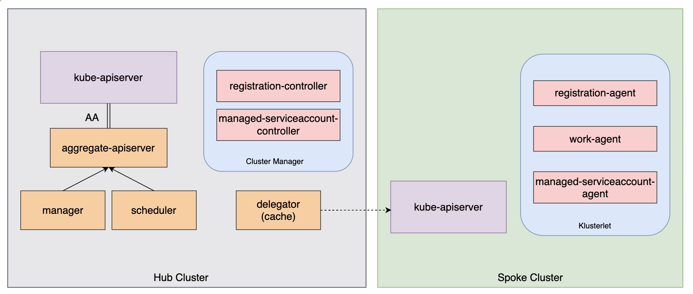

# Multi Cluster Platform (MCP)

[](https://goreportcard.com/report/github.com/multi-cluster-platform/mcp)
[](https://github.com/multi-cluster-platform/mcp/releases)
[](https://coveralls.io/github/multi-cluster-platform/mcp?branch=master)


## Architecture




## Roadmap

| release |                           feature                            |
| ------- | :----------------------------------------------------------: |
| v0.1.0  | basic process of resource publishing ( deployable scheduling, manifestWork creation) |
| v0.1.1  |  Implement  controller to handle manifest.template changes   |
| v0.1.2  |   Write back business cluster workload status to manifest    |
| v0.2.0  | Enhanced scheduler (multiple scheduling strategies, multiple clusters) |
| v1.0.0  |                support apiserver aggregation                 |


## How to debug

1. Create cluster with kind

   ```shell
   kind create cluster --name hub
   ```

2. Create CRDs

   ```shell
   kubectl apply -f deploy/crd
   kubectl apply -f https://raw.githubusercontent.com/open-cluster-management-io/api/main/work/v1/0000_00_work.open-cluster-management.io_manifestworks.crd.yaml
   ```

3. Startup scheduler & controller-manager, add params to debug: `--leader-elect=false --enable-crd-check=false -v=2`

4. [Optional] Debug for APIServer

   1. Create APIService for mcp-apiserver, `kubectl apply -f deploy/base/apiservice.yaml`
   2. Create Service、Endpoints to refers to local ip, `kubectl apply -f examples/mcp_server/service.yaml`
   3. Startup apiserver, add params: `kubeconfig, authentication-kubeconfig, authorization-kubeconfig, enable-local-debug` to cluster config


5. Create CR for test

   ```shell
   kubectl apply -f examples/applications
   ```


## Contact

- [slack](https://slack-yl52218.slack.com/archives/C035FS2NXPB)
